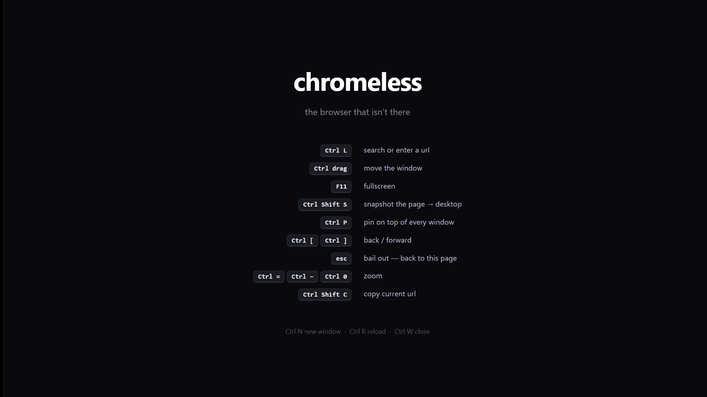

# chromeless

**The browser that isn't there.** The window *is* the webpage — no tabs, no toolbar, no address bar, no chrome at all. Made for clean screenshots, fullscreen YouTube, dashboards, and anything else that deserves the whole window.

A native Windows app built in Rust on [WebView2](https://developer.microsoft.com/en-us/microsoft-edge/webview2/) (the Edge/Chromium engine). No Electron, no webviews, just the platform.



## Build

```powershell
cargo build --release
target\release\chromeless.exe
```

Requires the [WebView2 Runtime](https://developer.microsoft.com/en-us/microsoft-edge/webview2/) (pre-installed on Windows 11; must be installed on Windows 10).

## Use

Everything is a keystroke (also listed on the start page):

| Keys | Action |
| --- | --- |
| `Ctrl+L` | Search or enter a URL (floating HUD) |
| `Ctrl+drag` | Move the window from anywhere |
| `F11` | Fullscreen |
| `Ctrl+Shift+S` | Snapshot the page as PNG → Desktop |
| `Ctrl+P` | Pin the window above everything |
| `Ctrl+[` / `Ctrl+]` | Back / forward |
| `Esc` | Bail out — back to the start page |
| `Ctrl+=` `Ctrl+-` `Ctrl+0` | Zoom in / out / reset |
| `Ctrl+Shift+C` | Copy the current URL |
| `Ctrl+R` / `Ctrl+Shift+R` | Reload / hard reload (bypass cache) |
| `Ctrl+N` / `Ctrl+W` | New window / close window |

The window remembers its frame and reopens your last page.

## CLI screenshot mode

Chromeless doubles as a webpage-to-PNG tool:

```powershell
cargo run -- https://example.com --snap shot.png --size 1440x900
cargo run -- localhost:3000 --snap dev.png --wait 3
```

It loads the page, waits for it to settle, writes a PNG, and exits.

## Notes

- Cookies and logins persist (kept in `%APPDATA%\chromeless\`), so YouTube stays signed in.
- Window corners use Windows 11's rounded corner preference (DWM).
- Deliberately absent: tabs, find-in-page, downloads, history UI, extensions. That's the point.

## License

[MIT](LICENSE)
